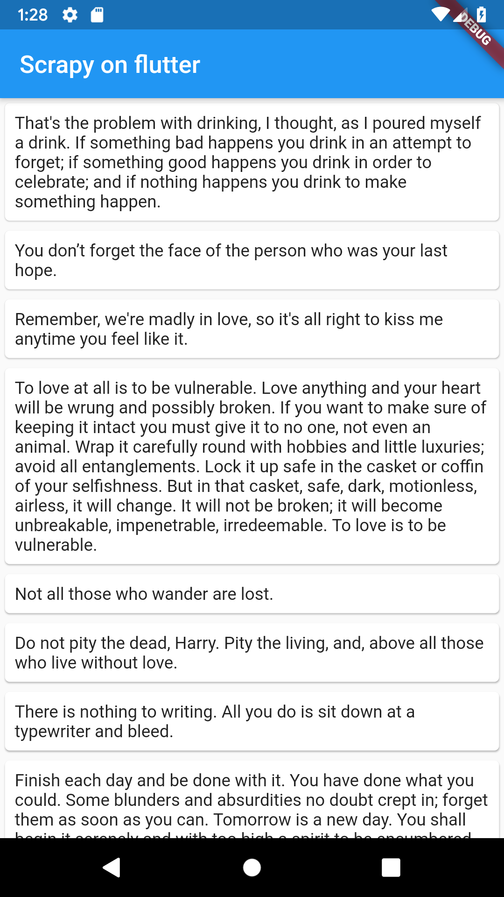

# scrapy  

[](https://pub.dartlang.org/packages/scrapy)

Scrapy, a fast high-level web crawling & scraping framework for dart and Flutter 


## Getting started

```dart
import 'package:scrapy/scrapy.dart';
import 'package:html/parser.dart' as html;
import 'package:http/http.dart';

class Quote extends Item {
  String quote;
  Quote({this.quote});
  @override
  String toString() {
    return "Quote : { quote : $quote }";
  }

  @override
  Map<String, dynamic> toJson() => {
        "quote": quote == null ? null : quote,
      };
  factory Quote.fromJson(String str) => Quote.fromMap(json.decode(str));
  factory Quote.fromMap(Map<String, dynamic> json) => Quote(
        quote: json["quote"] == null ? null : json["quote"],
      );
}

class Quotes extends Items {
  @override
  final List<Quote> items;
  Quotes({
    this.items,
  });

  factory Quotes.fromJson(String str) => Quotes.fromMap(json.decode(str));
  factory Quotes.fromMap(Map<String, dynamic> json) => Quotes(
        items: json["items"] == null
            ? null
            : List<Quote>.from(json["items"].map((x) => Quote.fromMap(x))),
      );
}

class BlogSpider extends Spider<Quote,Quotes> {
  Stream<String> parse(Response response) async* {
    final document = html.parse(response.body);
    final nodes = document.querySelectorAll("div.quote> span.text");

    for (var node in nodes) {
      yield node.innerHtml;
    }
  }

  @override
  Stream<String> Transform(Stream<String> stream) async* {
    await for (String parsed in stream) {
      final transformed = parsed;
      yield transformed.substring(1, parsed.length - 1);
    }
  }

  @override
  Stream<Quote> Save(Stream<String> stream) async* {
    await for (String transformed in stream) {
      final quote = Quote(quote: transformed);
      yield quote;
    }
  }
}

main() async {
  final spider = BlogSpider();
  spider.name = "myspider";
  spider.client = Client();
  spider.startUrls = [
    "http://quotes.toscrape.com/page/7/",
    "http://quotes.toscrape.com/page/8/",
    "http://quotes.toscrape.com/page/9/"
  ];

  final stopw = Stopwatch()..start();
  
  await spider.startRequests();
  await spider.saveResult();
  final elapsed = stopw.elapsed;

  print("the program took $elapsed"); //the program took 0:00:00.279733
}

```

### Example

Here a list view example on flutter showing the quotes we just scrapped and save on disk.



## Lightweight dependencies:
  - http

## TODOs
- [ ] tests
- [ ]  [link extractors](https://docs.scrapy.org/en/latest/topics/link-extractors.html)
- [ ] [download files](https://docs.scrapy.org/en/latest/topics/media-pipeline.html)